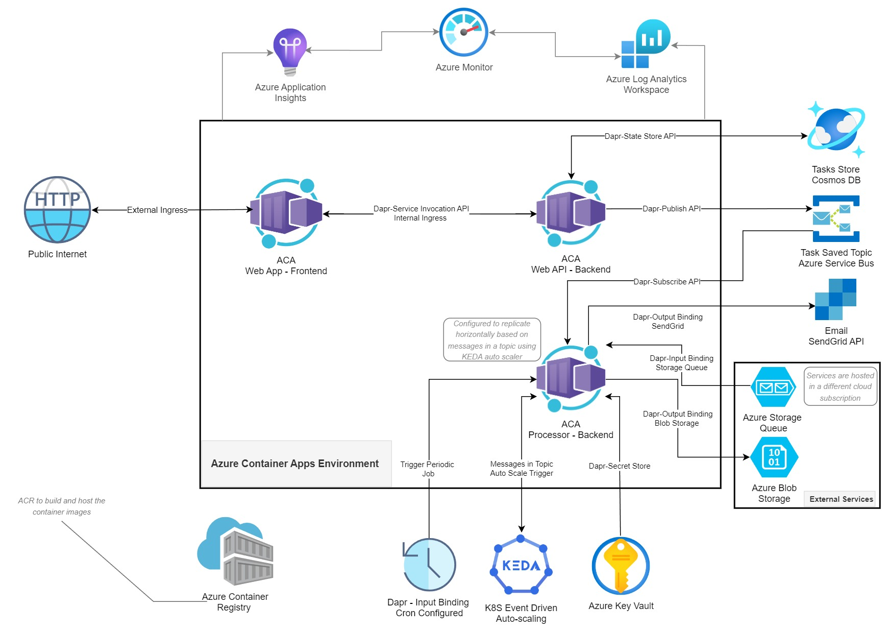

## Workshop Scenario

In this workshop we will build a tasks management application following the microservices architecture pattern, this application will consist of 3 microservices and each one has certain capabilities to show how ACA and Dapr can simplify the building of a microservices application. Below is the architecture diagram of the application we are going to build in this workshop.

## Solution Architecture 

1. "ACA Web App-Frontend" is a simple MVC Razor Web front-end application that accepts requests from public users to manage their tasks. It invokes the component "ACA WebAPI-Backend" endpoints via HTTP or gRPC.
2. "ACA WebAPI-Backend" is a backend Web API which contains the business logic of tasks management service, data storage, and publishing messages to Azure Service Bus Topic.
3. "ACA Processor-Backend" is an event-driven backend processor which is responsible to send emails to task owners based on messages coming from Azure Service Bus Topic.
4. Within "ACA Processor-Backend" service, there is a continuously running background processor to flag overdue tasks running continuously based on Dapr Cron timer configuration.
5. Autoscaling rules using KEDA are configured in the "ACA Processor-Backend" service to scale out/in replicas based on the the number of messages in the Azure Service Bus Topic. 
6. Use Azure Container Registry to build and host container images and deploy images from ACR to Azure Container Apps.
7. Using Application Insights and Azure Log Analytics for Monitoring, Observability, and distributed tracings of ACA.