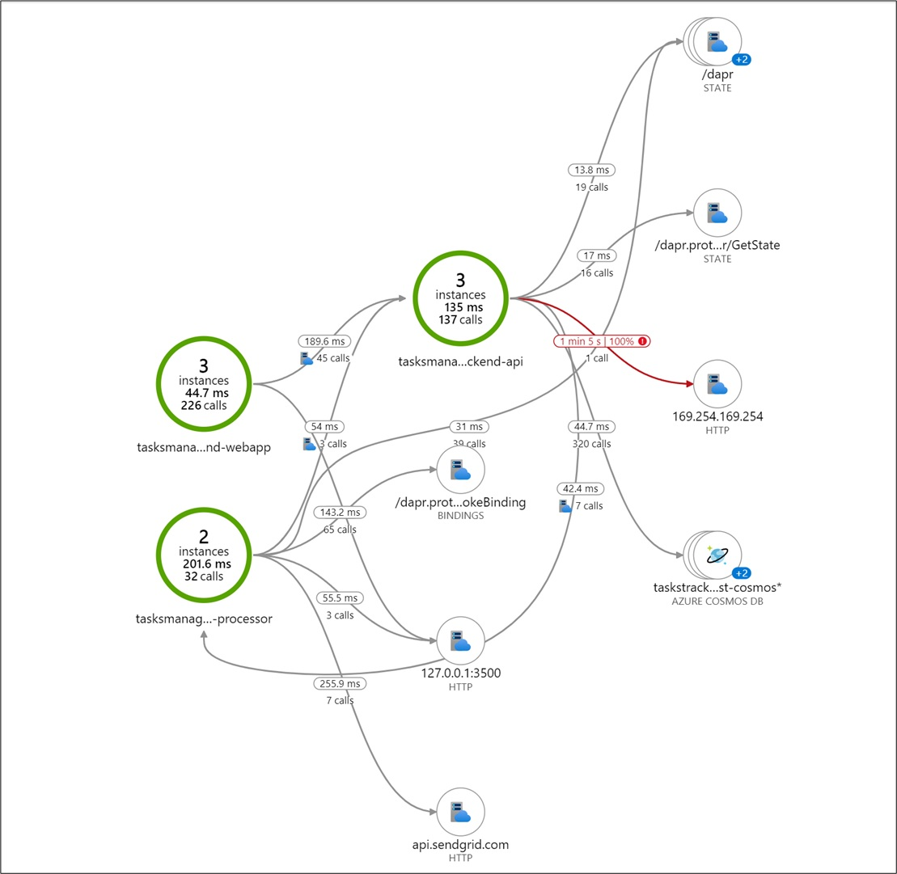
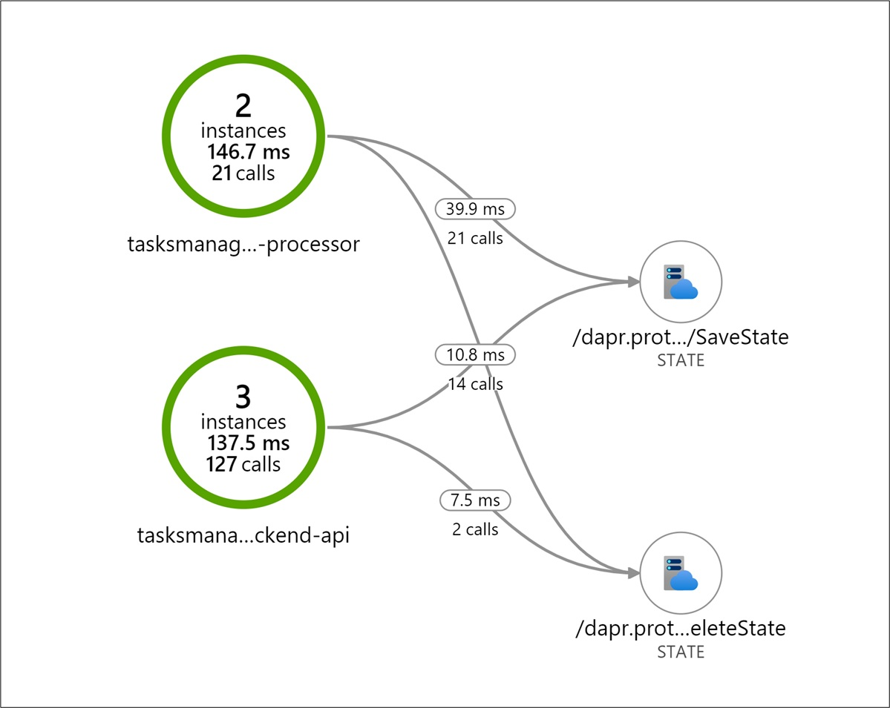
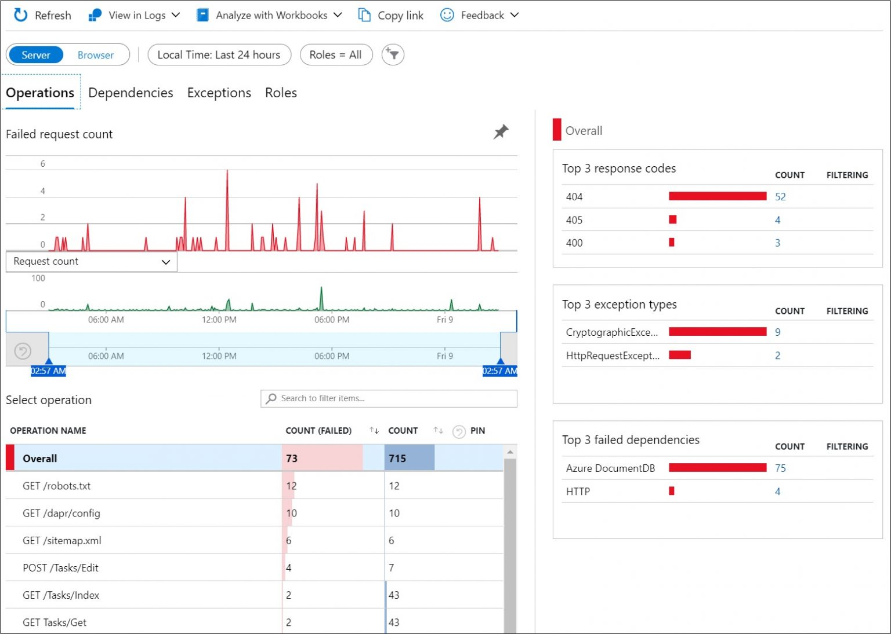

# Module 8 - ACA Monitoring and Observability with Application Insights
In this module, we will explore how we can configure ACA and ACA Environment with [Application Insights](https://docs.microsoft.com/en-us/azure/azure-monitor/app/app-insights-overview) which will provide a holistic view of our container apps health, performance metrics, logs data, various telemetries and traces.
ACA do not support [Auto-Instrumentation](https://learn.microsoft.com/en-us/azure/azure-monitor/app/codeless-overview#supported-environments-languages-and-resource-providers) for Application Insights, so in this module, we will be focusing on how we can integrate Application Insights into our microservices application.

### Application Insights overview
Application Insights is an offering from Azure Monitor that will help us to monitor all ACAs under the same Container App Environment and collect telemetry about the services within the solution, as well as understand the usage of the services and users' engagement via integrated analytics tools.

What we mean by Telemetry here is the data collected to observe our application, it can be broken into three categories :

1. Distributed Tracing: provides insights into the traffic between services involved in distributed transactions, think of when the Frontend Web App talks with the Backend Api App to insert or retrieve data. An application map of how calls are flowing between services is very important for any distributed application.
2. Metrics: provide insights into the performance of a service and its resource utilization, think of the CPU and Memory utilization of the Backend Background processor, and how we can understand when we need to increase the number of replicas.
3. Logging: provides insights into how code is executing and if errors have occurred.

In this [module](../../aca/01-deploy-api-to-aca/index.md#2-deploy-web-api-backend-project-to-aca) we have already provision a Workspace-based Application Insights Instance and configured it with ACA environment by setting the property `--dapr-instrumentation-key` whn creating the environment, so we will assume that you have already an instance of Application Insights created and ready to be used in the 3 Contains Apps.

### Installing Application Insights SDK into the 3 Microservices apps

##### 1. Install the Application Insights SDK using NuGet
Now we need to add Application Insights SDK to the 3 services we have, this is an identical operation, so I will describe how we can do it on the Backend API and you do the same on the remaining services.

To add the SDK, open the file `TasksTracker.TasksManager.Backend.Api.csproj` and add the below NuGet reference

```json
  <ItemGroup>
    <!--Other packages are removed for brevity-->
    <PackageReference Include="Microsoft.ApplicationInsights.AspNetCore" Version="2.21.0" />
  </ItemGroup>
```
Do not forget to do the same in the other 2 projects.

##### 2. Set RoleName property in all the services

Next and on each project, we will add a new file named `AppInsightsTelemetryInitializer.cs` on the root directory of the project, so add a file named `AppInsightsTelemetryInitializer.cs` under project “TasksTracker.TasksManager.Backend.Api and paste the below:

```csharp
namespace TasksTracker.TasksManager.Backend.Api
{
    public class AppInsightsTelemetryInitializer : ITelemetryInitializer
    {
        public void Initialize(ITelemetry telemetry)
        {
            if (string.IsNullOrEmpty(telemetry.Context.Cloud.RoleName))
            {
                //set custom role name here
                telemetry.Context.Cloud.RoleName = "tasksmanager-backend-api";
            }
        }
    }
}
```

The only difference between each file on the 3 projects is the **RoleName** property value, this property will be used by Application Insights to identify the components on the application map, as well for example it will be useful for us if we need to filter on all the warning logs generated from the Backend API service, so we will use the value `tasksmanager-backend-api` when we filter.
You can check the `AppInsightsTelemetryInitializer.cs` files and the RoleName value used in the other projects by clicking on this link [TasksTracker.WebPortal.Frontend.Ui](https://github.com/Azure/aca-dotnet-workshop/blob/a642c296d8f35b9c81a17e63c11797aee9066f5a/TasksTracker.WebPortal.Frontend.Ui/AppInsightsTelemetryInitializer.cs) and on this link [TasksTracker.Processor.Backend.Svc](https://github.com/Azure/aca-dotnet-workshop/blob/a642c296d8f35b9c81a17e63c11797aee9066f5a/TasksTracker.Processor.Backend.Svc/AppInsightsTelemetryInitializer.cs). Do not forget to create the class `AppInsightsTelemetryInitializer.cs` with the correct RoleName value on the other projects.

Next, we need to register this `AppInsightsTelemetryInitializer` class, to do this, open the file `Program.cs` and add the code below, don't forget that you need to do the same for the remaining 2 projects.

```csharp
//Code removed for brevity 
builder.Services.AddApplicationInsightsTelemetry();
builder.Services.Configure<TelemetryConfiguration>((o) => {
    o.TelemetryInitializers.Add(new AppInsightsTelemetryInitializer());
});
var app = builder.Build();
//Code removed for brevity
```

##### 3. Set the Application Insights instrumentation key
In the previous module, we've used Dapr Secret Store to store connection strings and keys, on this module we will demonstrate how we can use another approach to secrets in Container Apps.

Now we need to set the Application Insights Instrumentation Key so the projects are able to send telemetry data to the AI instance, to do this open file `appsettings.json` and paste the code below, we are going to set this via secrets and environment variables once we redeploy the Container Apps and create new revisions.

```josn
{
  "ApplicationInsights": {
    "InstrumentationKey": ""
  } 
}
```
With this step completed, we have done all the changes needed. let's now deploy the changes and create new ACA revisions.

### Deploy services to ACA and create new Revisions

##### 1. Add Application Insights Instrumentation key as a secret
Let`s create a secret named `appinsights-key` on each Container App which contains the value of the AI instrumentation key, remember that we can obtain this value from Azure Portal by going to AI instance we created or we can get it from Azure CLI as we did in module 1. To create the secret use PowerShell console and paste the code below:
```powershell
az containerapp secret set `
--name $BACKEND_API_NAME `
--resource-group $RESOURCE_GROUP `
--secrets "appinsights-key=<AI Key Here>"

az containerapp secret set `
--name $FRONTEND_WEBAPP_NAME `
--resource-group $RESOURCE_GROUP `
--secrets "appinsights-key=<AI Key Here>"

az containerapp secret set `
--name $BACKEND_SVC_NAME `
--resource-group $RESOURCE_GROUP `
--secrets "appinsights-key=<AI Key Here>"
```

###### 2. Build new images and push them to ACR
As we have done previously we need to build and push the 3 apps images to ACR so they are ready to be deployed to ACA. To accomplish this, continue using the same PowerShell console and paste the code below (Make sure you are on directory `TasksTracker.ContainerApps`):

```powershell
## Build Backend API on ACR and Push to ACR
az acr build --registry $ACR_NAME --image "tasksmanager/$BACKEND_API_NAME" --file 'TasksTracker.TasksManager.Backend.Api/Dockerfile' . 
## Build Backend Service on ACR and Push to ACR
az acr build --registry $ACR_NAME --image "tasksmanager/$BACKEND_SVC_NAME" --file 'TasksTracker.Processor.Backend.Svc/Dockerfile' .
## Build Frontend Web App on ACR and Push to ACR
az acr build --registry $ACR_NAME --image "tasksmanager/$FRONTEND_WEBAPP_NAME" --file 'TasksTracker.WebPortal.Frontend.Ui/Dockerfile' .
```

##### 3. Deploy new revisions of the services to ACA and set a new environment variable

As we've done multiple times, we need to update the ACA hosting the 3 services with a new revision so our code changes are available for end users. To accomplish this, run the below PowerShell script. Notice how we used the property `--set-env-vars` to set new environment variable named `ApplicationInsights__InstrumentationKey` and its value is a secret reference coming from the secret `appinsights-key` we added in [step 1](#1-add-application-insights-instrumentation-key-as-a-secret).

```powershell
## Update Backend API App container app and create a new revision 
az containerapp update `
--name $BACKEND_API_NAME  `
--resource-group $RESOURCE_GROUP `
--revision-suffix v20230301-1 `
--set-env-vars "ApplicationInsights__InstrumentationKey=secretref:appinsights-key"

## Update Frontend Web App container app and create a new revision 
az containerapp update `
--name $FRONTEND_WEBAPP_NAME  `
--resource-group $RESOURCE_GROUP `
--revision-suffix v20230301-1 `
--set-env-vars "ApplicationInsights__InstrumentationKey=secretref:appinsights-key"

## Update Backend Background Service container app and create a new revision 
az containerapp update `
--name $BACKEND_SVC_NAME `
--resource-group $RESOURCE_GROUP `
--revision-suffix v20230301-1 `
--set-env-vars "ApplicationInsights__InstrumentationKey=secretref:appinsights-key"
```
With those changes in place, you should start seeing telemetry coming to the Application Insights instance provisioned, let's review Application Insights key dashboards and panels in Azure Portal.

### Distributed Tracing via Application Map
Application Map will help us to spot any performance bottlenecks or failure hotspots across all our services of our distributed microservices application. Each node on the map represents an application component (service) or its dependencies and has a health KPI and alerts status.



Looking at the image above, you will see for example how the Backend Api with could RoleName `tasksmanager-backend-api` is depending on the Cosmos DB instance, showing the number of calls and average time to service these calls. The application map is interactive so you can select a service/component and drill down into details. For example, when we drill down into the Dapr State node to understand how many times my backend API invoked the Dapr Sidecar state service to Save/Delete state, you will see results similar to the below image:


### Monitor production application using Live Metrics
This is one of my favorite monitoring panels, it provides you with near real-time (1-second latency) status of your entire distributed application, we can see performance and failures count, we can watch exceptions and traces as they happened, and we can see live servers (replicas in our case) and the CPU and Memory utilization and the number of requests they are handling.
These live metrics provide very powerful diagnostics for our production microservice application. Check the image below and see the server names and some requests coming to the system.


### Logs search using Transaction Search

Transaction search in Application Insights will help us to find and explore individual telemetry items, such as exceptions, web requests, or dependencies. As well as any log traces and events that we’ve added to the application.
For example, if we want to see all the event types of type `Request` for the cloud RoleName `tasksmanager-backend-api` in the past 24 hours, we can use the transaction search dashboard to do this, see how the filters are set and the results are displayed nicely, we can drill down on each result to have more details and what telemetry was captured before and after. A very useful feature when troubleshooting exceptions and reading logs.


### Failures and Performance Panels
The failure panel allows us to view the frequency of failures across different operations to help us to focus our efforts on those with the highest impact.


The Performance panel displays performance details for the different operations in our system. By identifying those operations with the longest duration, we can diagnose potential problems or best target our ongoing development to improve the overall performance of the system.
